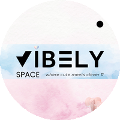
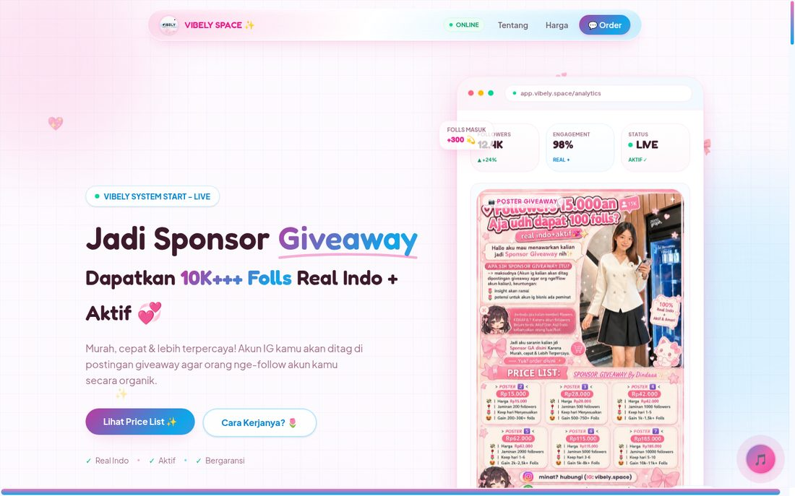
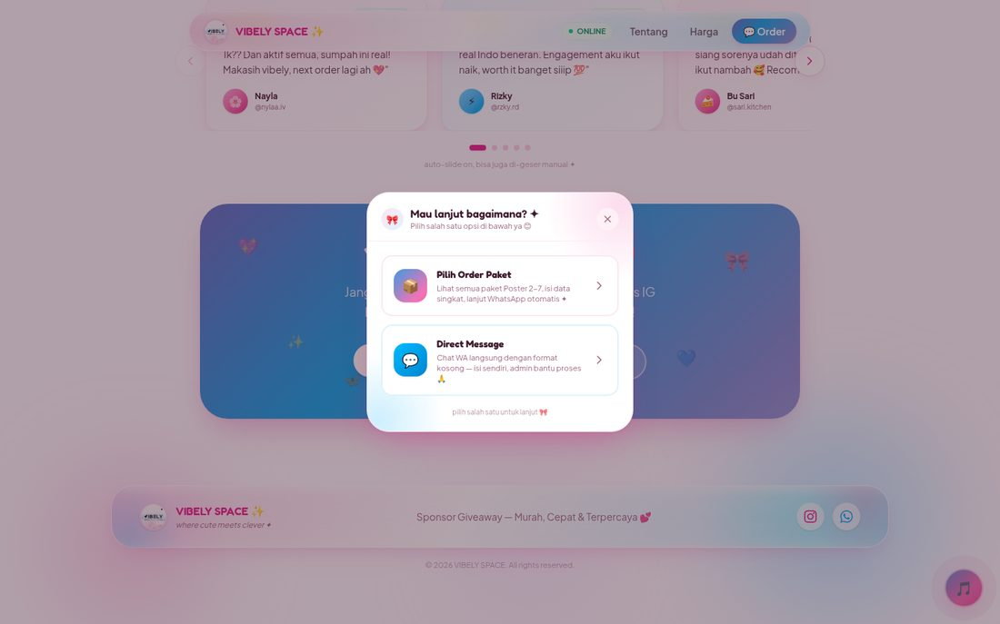
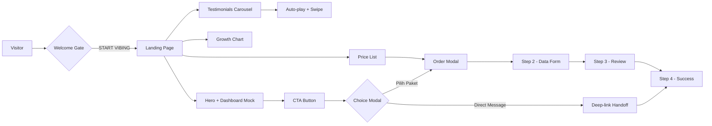

<div align="center">



# VIBELY SPACE ✨

**Sponsor Giveaway Landing Platform — modern marketing site with an iOS 27 "Liquid Glass" design system**

Built with Next.js 16 · React 19 · Tailwind CSS 4 · TypeScript

[](https://vibely-space.vercel.app)
[](https://nextjs.org)
[](https://react.dev)
[](https://www.typescriptlang.org)
[](https://tailwindcss.com)

</div>

---

## 📸 Preview

| Hero — Dashboard Mock & Growth Chart | Order Flow — Multi-step Modal |
| :---: | :---: |
|  |  |

---

## ✨ Highlights

- 🫧 **iOS 27 Liquid Glass Design System** — frosted glassmorphism material built from scratch: layered `backdrop-filter` (blur + saturate + brightness), dual-gradient surface tint, and multi-layer inset specular highlights
- 📊 **Animated Marketing Dashboard Mockup** — KPI cards, bar charts, and a live-badge post preview rendered purely with CSS
- 📈 **Custom SVG Growth Chart** — hand-rolled Catmull-Rom → Bézier curve smoothing, animated path drawing (`stroke-dashoffset`), milestone dots, and count-up number animation on scroll
- 🛒 **3-Step Order Modal Flow** — package selection → data form → review → deep-link handoff, fully client-side with zero backend dependency
- 🎠 **Hybrid Testimonial Carousel** — auto-play (4.5s interval) that pauses on interaction and auto-resumes after 3s, combined with native scroll-snap dragging
- 🎬 **Scroll-reveal Choreography** — IntersectionObserver-based `Reveal` wrapper with staggered delays across every section
- 🎀 **Micro-interactions Everywhere** — floating stickers, blob animations, gradient shifts, heartbeat/sparkle keyframes, count-up stats
- 🎵 **Welcome Gate + Ambient Music Player** — liquid-glass entry popup wired to a looping audio experience
- 🔍 **SEO-ready** — Open Graph metadata, `sitemap.xml`, `robots.txt`, semantic HTML, Indonesian-language content

---

## 🛠 Tech Stack

| Layer | Technology | Notes |
| :--- | :--- | :--- |
| Framework | **Next.js 16** (App Router) | Turbopack builds, static prerendering |
| UI Library | **React 19** | Client components for interactive islands |
| Language | **TypeScript 5** | Strict typing across the app |
| Styling | **Tailwind CSS 4** | `@theme inline` design tokens, custom utilities |
| Components | **shadcn/ui** (Radix primitives) | Dialogs, buttons, cards, toasts |
| Icons | **lucide-react** | Tree-shakeable SVG icon set |
| Typography | **Fredoka** + **Plus Jakarta Sans** | Self-hosted via `next/font/google` |
| Animation | CSS keyframes + custom `Reveal` | Zero animation-library overhead |
| Deployment | **Vercel** | Edge CDN, automatic CI/CD from `main` |

---

## 🧩 Architecture



**State management** is intentionally lightweight — no Redux/Zustand. Modal orchestration uses lifted React state (`useState` + context provider) so every CTA on the page can open the same order flow.

---

## 🎨 Design System

### Liquid Glass Material

The signature glassmorphism is implemented as a reusable `.liquid-glass` utility:

```css
.liquid-glass {
  background:
    /* vertical specular sheen */
    linear-gradient(180deg,
      rgba(255,255,255,.55) 0%, rgba(255,255,255,.15) 18%,
      rgba(255,255,255,.05) 50%, rgba(255,255,255,.12) 82%,
      rgba(255,255,255,.35) 100%),
    /* horizontal pink → sky tint */
    linear-gradient(120deg,
      rgba(244,114,182,.30) 0%,
      rgba(255,255,255,.18) 45%,
      rgba(56,189,248,.30) 100%);
  border: 1px solid rgba(255,255,255,.7);
  box-shadow:
    0 10px 36px rgba(233,30,140,.18),
    inset 0 1.5px 1px rgba(255,255,255,1),
    inset 0 -1px 1px rgba(255,255,255,.45),
    inset 0 0 12px rgba(255,255,255,.18);
}
```

> ⚠️ **Engineering note:** `backdrop-filter` is applied via **inline style** (not the stylesheet) because the production CSS minifier strips the standard property when declared alongside its `-webkit-` prefix. The inline-style pattern guarantees the blur survives minification on both Chromium and Safari.

### Color Tokens

| Token | Hex | Usage |
| :--- | :--- | :--- |
| `--primary` | `#E91E8C` | Brand pink — CTAs, accents |
| `--background` | `#FDFAFE` | Warm off-white canvas |
| `--foreground` | `#3D1A2B` | Deep plum text |
| Sky accent | `#0EA5E9` | Gradient partner, secondary CTAs |
| `--secondary` | `#FDE9F1` | Soft pink surfaces |

### Typography

- **Display:** Fredoka (400–700) — headings, playful brand voice
- **Body:** Plus Jakarta Sans (400–800) — readable, modern UI text

---

## 📂 Project Structure

```text
vibely-space/
├── src/
│   ├── app/
│   │   ├── layout.tsx        # Root layout, fonts, SEO metadata
│   │   ├── page.tsx          # Single-page site (all sections + modals)
│   │   ├── globals.css       # Design tokens, keyframes, glass utilities
│   │   ├── sitemap.ts        # Dynamic sitemap generation
│   │   └── api/              # Route handlers
│   ├── components/
│   │   ├── ui/               # shadcn/ui primitives (Radix-based)
│   │   └── v2/               # Multi-page prototype components (R&D)
│   └── lib/                  # Utility helpers
├── public/
│   ├── music/                # Ambient loop audio
│   └── *.png / *.jpg         # Optimized static assets
├── scripts/                  # Image-pipeline Python scripts (Pillow)
└── docs/                     # README preview assets
```

---

## 🚀 Getting Started

### Prerequisites

- Node.js 20+
- npm / pnpm / bun

### Installation

```bash
# clone the repo
git clone https://github.com/lutfananas/vibely-space.git
cd vibely-space

# install dependencies
npm install

# start the dev server (Turbopack)
npm run dev
```

Open [http://localhost:3000](http://localhost:3000) 🎉

### Production Build

```bash
npm run build
npm run start
```

---

## ⚡ Performance & UX Decisions

| Decision | Rationale |
| :--- | :--- |
| Static prerendering | The whole page ships as static HTML — instant first paint on Vercel's edge |
| Inline `backdrop-filter` | Immune to CSS-minifier prefix-stripping; verified in production builds |
| CSS-only animations | Keyframes over JS animation libs keeps the bundle lean |
| Scroll-snap carousel | Native touch physics on mobile; JS only for auto-play & arrows |
| Single-file page module | Section components colocated for fast iteration at this scale |
| `next/font` self-hosting | Zero layout shift, no external font requests |

---

## ☁️ Deploy on Vercel

The site deploys automatically to Vercel on every push to `main`.

[](https://vercel.com/new/clone?repository-url=https://github.com/lutfananas/vibely-space)

---

<div align="center">

**VIBELY SPACE ✨** — *where cute meets clever*

Built with 💕 using Next.js · React · Tailwind CSS

</div>
